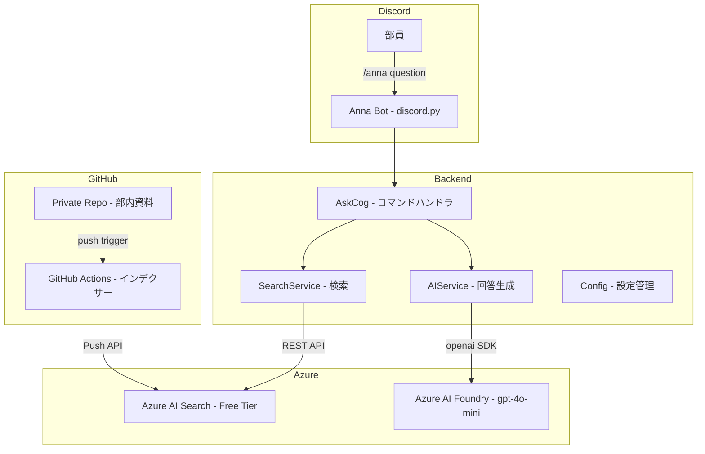
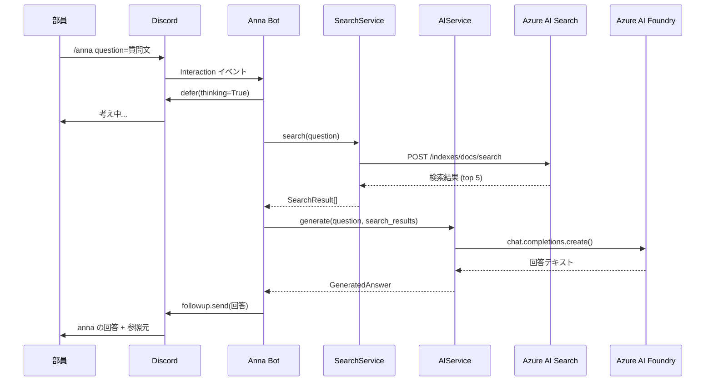
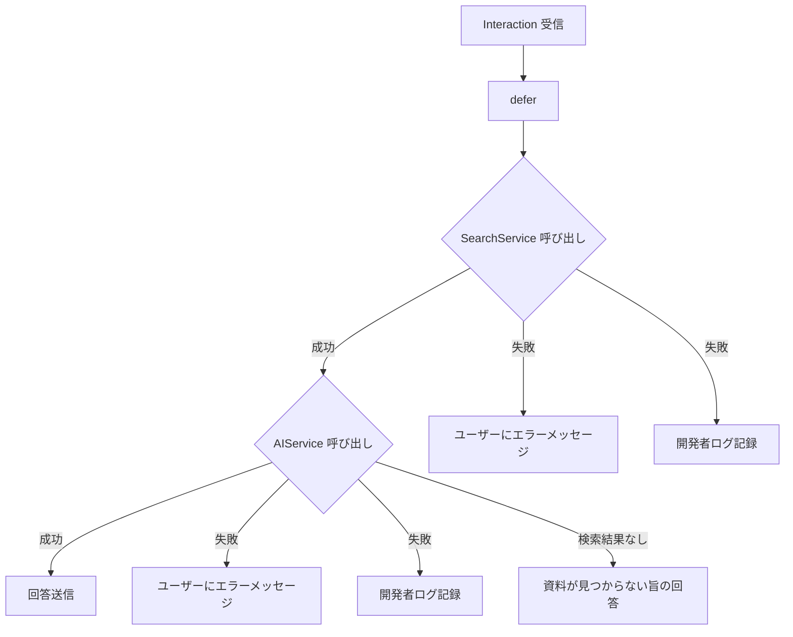
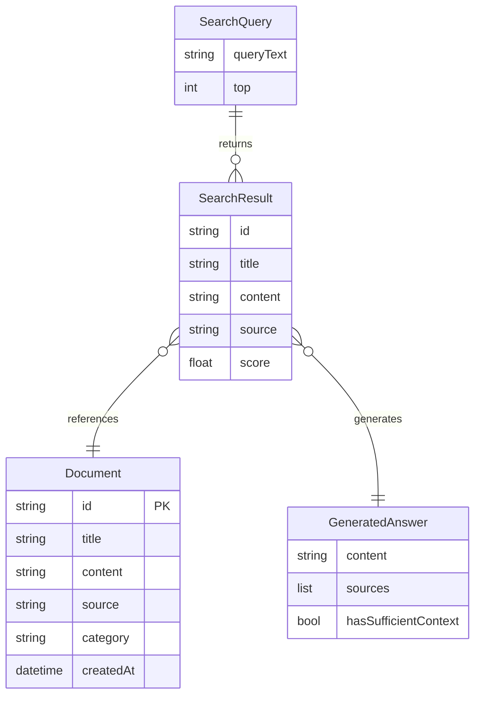

# Design Document — anna-qa-command

## Overview

**Purpose**: `/anna` スラッシュコマンドにより、部員が Discord 上で部内資料を RAG 検索し、マスコットキャラクター anna として自然な日本語で回答を受け取れる機能を提供する。

**Users**: 部員・幹部・新入部員が、部の規則・イベント情報・引き継ぎ情報の確認に利用する。

**Impact**: 部内ナレッジへのアクセスを自動化し、情報の属人化を解消する。

### Goals
- `/anna` コマンドで部内資料に基づく回答を数秒〜十数秒以内に返す
- anna キャラクターとしての一貫した口調を維持する
- Azure Free Tier を活用し、運用コストを最小化する
- 将来の検索方式拡張（ベクトル検索）や機能追加に対応できる構造にする

### Non-Goals
- 画像・音声・PDF の高度な処理
- 管理画面の構築
- 部員ごとの個人化・長期記憶
- 高度なアクセス制御・権限管理
- ベクトル検索・セマンティックランキング（MVP 後に検討）

## Architecture

### Architecture Pattern & Boundary Map

3 層のレイヤードアーキテクチャを採用し、Discord 層・RAG 層・AI 層の責務を分離する。



**Architecture Integration**:
- Selected pattern: Layered Architecture — 学生プロジェクトに適したシンプルな構成
- Domain boundaries: Cog（Discord I/O）、SearchService（検索）、AIService（回答生成）で責務を分離
- New components rationale: 各コンポーネントは 1 つの外部サービスに対応し、単一責任を維持
- Steering compliance: steering の 3 層分離方針（Discord 層 / RAG 層 / AI 層）に準拠

### Technology Stack

| Layer | Choice / Version | Role in Feature | Notes |
|-------|------------------|-----------------|-------|
| Runtime | Python 3.12 | アプリケーション実行環境 | uv でパッケージ管理 |
| Bot Framework | discord.py v2.x | Discord スラッシュコマンド処理 | app_commands モジュール使用 |
| HTTP Client | aiohttp | Azure REST API 呼び出し | discord.py の依存関係として同梱 |
| LLM SDK | openai v1.x | Azure AI Foundry チャット補完 | AsyncAzureOpenAI クラス |
| Search | Azure AI Search Free Tier | 部内資料の全文検索 | ja.lucene アナライザー、BM25 |
| AI Model | gpt-4o-mini | 回答生成 | 最もコスト効率が高い |
| CI/CD | GitHub Actions | インデックス自動更新 | push トリガー |
| Config | python-dotenv | 環境変数管理 | .env ファイルから読み込み |

## System Flows

### 質問応答フロー（正常系）



### エラーハンドリングフロー



## Requirements Traceability

| Requirement | Summary | Components | Interfaces | Flows |
|-------------|---------|------------|------------|-------|
| 1.1 | スラッシュコマンド表示 | AskCog | Discord Interaction | 質問応答フロー |
| 1.2 | 3秒以内の defer | AskCog | Discord Interaction | 質問応答フロー |
| 1.3 | 回答で defer を更新 | AskCog | Discord Interaction | 質問応答フロー |
| 1.4 | 空入力のバリデーション | AskCog | Discord Interaction | — |
| 2.1 | AI Search への検索クエリ送信 | SearchService | SearchService Interface | 質問応答フロー |
| 2.2 | 上位ドキュメントの取得 | SearchService | SearchService Interface | 質問応答フロー |
| 2.3 | 検索結果なしのハンドリング | SearchService, AIService | SearchService Interface | エラーフロー |
| 2.4 | API キーの環境変数管理 | Config | — | — |
| 2.5 | GitHub Actions によるインデックス更新 | IndexerWorkflow | Push API | — |
| 3.1 | AI Foundry で回答生成 | AIService | AIService Interface | 質問応答フロー |
| 3.2 | 根拠に基づく回答 | AIService | System Prompt | — |
| 3.3 | 情報不足時の正直な回答 | AIService | System Prompt | エラーフロー |
| 3.4 | 参照元の提示 | AIService, AskCog | AIService Interface | 質問応答フロー |
| 4.1-4.4 | キャラクター口調 | AIService | System Prompt | — |
| 5.1-5.4 | エラーハンドリング | AskCog | Error Handler | エラーフロー |
| 6.1-6.4 | ログ記録 | AskCog, Logger | Logging | 両フロー |
| 7.1-7.4 | セキュリティ | Config, 全コンポーネント | — | — |
| 8.1-8.3 | 運用・保守性 | Config, README | — | — |

## Components and Interfaces

| Component | Domain/Layer | Intent | Req Coverage | Key Dependencies | Contracts |
|-----------|------------|--------|--------------|------------------|-----------|
| AskCog | Discord 層 | スラッシュコマンドの受付と応答 | 1.1-1.4, 3.4, 5.1-5.4, 6.1-6.2 | SearchService (P0), AIService (P0) | Service |
| SearchService | RAG 層 | Azure AI Search への検索リクエスト | 2.1-2.4 | Azure AI Search (P0), Config (P0) | Service |
| AIService | AI 層 | LLM による回答生成 | 3.1-3.4, 4.1-4.4 | Azure AI Foundry (P0), Config (P0) | Service |
| Config | 横断 | 環境変数と設定値の一元管理 | 7.1-7.2, 8.1 | python-dotenv (P1) | State |
| IndexerWorkflow | CI/CD | GitHub Actions によるインデックス更新 | 2.5 | Azure AI Search Push API (P0) | Batch |

### Discord 層

#### AskCog

| Field | Detail |
|-------|--------|
| Intent | `/anna` スラッシュコマンドを受け付け、検索・回答生成を orchestrate し、結果を Discord に返す |
| Requirements | 1.1, 1.2, 1.3, 1.4, 3.4, 5.1-5.4, 6.1-6.2 |

**Responsibilities & Constraints**
- Discord Interaction の受信と Deferred Response の送信
- SearchService → AIService の呼び出しオーケストレーション
- エラーハンドリングとユーザー向けメッセージの生成
- 回答のフォーマット（参照元の付与、文字数制限の考慮）

**Dependencies**
- Inbound: Discord Gateway — Interaction イベント受信 (P0)
- Outbound: SearchService — 検索リクエスト (P0)
- Outbound: AIService — 回答生成リクエスト (P0)
- External: Discord API — followup メッセージ送信 (P0)

**Contracts**: Service [x]

##### Service Interface
```python
class AskCog(commands.Cog):
    @app_commands.command(name="anna", description="anna に質問する")
    @app_commands.describe(question="質問内容")
    async def ask(self, interaction: discord.Interaction, question: str) -> None:
        """
        Preconditions: question は空でない文字列
        Postconditions: Discord に回答メッセージが送信される
        Invariants: 3秒以内に defer が呼ばれる
        """
        ...
```

**Implementation Notes**
- defer は必ずメソッドの最初に呼び出す。検索・生成処理の前にバリデーションが必要な場合でも、先に defer してからバリデーションを行う
- 回答が 2000 文字を超える場合は Embed を使用するか、末尾を省略する
- エラー発生時はユーザー向けメッセージを followup で送信し、詳細は logger に記録

### RAG 層

#### SearchService

| Field | Detail |
|-------|--------|
| Intent | Azure AI Search に対してクエリを送信し、関連ドキュメントを取得する |
| Requirements | 2.1, 2.2, 2.3, 2.4 |

**Responsibilities & Constraints**
- 検索クエリの構築と Azure AI Search REST API への送信
- 検索結果のパースと上位ドキュメントの抽出
- 検索結果なしの状態を呼び出し元に通知

**Dependencies**
- Inbound: AskCog — 検索リクエスト (P0)
- Outbound: Azure AI Search — REST API (P0)
- Outbound: Config — エンドポイント、API キー、インデックス名 (P0)

**Contracts**: Service [x] / API [x]

##### Service Interface
```python
from dataclasses import dataclass


@dataclass
class SearchResult:
    id: str
    title: str
    content: str
    source: str
    score: float


class SearchService:
    async def search(self, query: str, top: int = 5) -> list[SearchResult]:
        """
        Azure AI Search に対して BM25 検索を実行し、関連ドキュメントを返す。

        Preconditions: query は空でない文字列、top は 1 以上
        Postconditions: score 降順でソートされた SearchResult のリスト（0〜top 件）
        Invariants: API キーはソースコードに含まれない
        """
        ...
```

##### API Contract

| Method | Endpoint | Request | Response | Errors |
|--------|----------|---------|----------|--------|
| POST | `https://<service>.search.windows.net/indexes/<index>/docs/search?api-version=2024-07-01` | `{"search": "<query>", "top": 5, "select": "id,title,content,source", "queryType": "simple"}` | `{"value": [{"@search.score": float, ...}]}` | 401, 403, 404, 429, 503 |

### AI 層

#### AIService

| Field | Detail |
|-------|--------|
| Intent | 検索結果をコンテキストとして LLM に渡し、anna キャラクターとしての回答を生成する |
| Requirements | 3.1, 3.2, 3.3, 3.4, 4.1, 4.2, 4.3, 4.4 |

**Responsibilities & Constraints**
- システムプロンプトの構築（キャラクター指示 + 検索コンテキスト）
- Azure AI Foundry チャット補完 API の呼び出し
- 回答テキストと参照元情報の抽出

**Dependencies**
- Inbound: AskCog — 回答生成リクエスト (P0)
- External: Azure AI Foundry (gpt-4o-mini) — チャット補完 API (P0)
- Outbound: Config — エンドポイント、API キー、デプロイメント名 (P0)

**Contracts**: Service [x]

##### Service Interface
```python
from dataclasses import dataclass


@dataclass
class GeneratedAnswer:
    content: str
    sources: list[str]
    has_sufficient_context: bool


class AIService:
    async def generate(
        self,
        question: str,
        search_results: list[SearchResult],
    ) -> GeneratedAnswer:
        """
        検索結果をコンテキストとして LLM に渡し、anna としての回答を生成する。

        Preconditions: question は空でない文字列
        Postconditions: GeneratedAnswer が返される。search_results が空の場合、
                        has_sufficient_context=False となり、資料が見つからなかった旨の回答が生成される
        Invariants: 回答は anna キャラクターの口調を維持する
        """
        ...
```

**Implementation Notes**
- システムプロンプトにキャラクター指示と検索結果を含める
- `temperature=0.3`, `max_tokens=800` で事実性と簡潔さのバランスを取る
- 検索結果が空の場合は「資料に見当たらなかった」旨を正直に回答するよう指示

### 横断

#### Config

| Field | Detail |
|-------|--------|
| Intent | 環境変数から設定値を読み込み、各コンポーネントに提供する |
| Requirements | 7.1, 7.2, 8.1 |

**Responsibilities & Constraints**
- `.env` ファイルからの環境変数読み込み
- 必須項目の存在チェックと起動時バリデーション
- シークレットのソースコード混入防止

**Contracts**: State [x]

##### State Management
```python
from dataclasses import dataclass


@dataclass(frozen=True)
class Config:
    # Discord
    discord_token: str

    # Azure AI Search
    search_endpoint: str
    search_api_key: str
    search_index_name: str

    # Azure AI Foundry
    azure_openai_endpoint: str
    azure_openai_api_key: str
    azure_openai_deployment: str
    azure_openai_api_version: str

    @classmethod
    def from_env(cls) -> "Config":
        """
        環境変数から Config を生成する。
        必須項目が欠けている場合は起動時に ValueError を送出する。
        """
        ...
```

- Persistence: `.env` ファイル（ローカル開発）、環境変数（デプロイ時）
- Consistency: frozen dataclass で不変性を保証
- Concurrency: 読み取り専用のため並行性の問題なし

### CI/CD

#### IndexerWorkflow

| Field | Detail |
|-------|--------|
| Intent | GitHub リポジトリへの push をトリガーに、部内資料を Azure AI Search にインデックス投入する |
| Requirements | 2.5 |

**Contracts**: Batch [x]

##### Batch Contract
- **Trigger**: 部の GitHub Organization の private リポジトリへの push（対象ブランチ: main）
- **Input**: リポジトリ内の Markdown ファイル（`docs/` ディレクトリ等）
- **Validation**: ファイル拡張子フィルタ（`.md` のみ）、空ファイルの除外
- **Output**: Azure AI Search インデックスへのドキュメント投入
- **Idempotency**: `mergeOrUpload` アクションにより、同一 ID のドキュメントは上書き更新。ドキュメント ID はファイルパスから生成

**Implementation Notes**
- GitHub Actions ワークフロー（`.github/workflows/index-docs.yml`）として実装
- Secrets: `AZURE_SEARCH_ENDPOINT`, `AZURE_SEARCH_API_KEY`, `AZURE_SEARCH_INDEX_NAME` を GitHub Secrets に登録
- バッチサイズ: 1リクエストあたり最大 1,000 docs（Free Tier の上限 10,000 docs 以内で運用）

## Data Models

### Domain Model



- **Document**: Azure AI Search インデックス内のドキュメント。部内資料 1 件に対応
- **SearchQuery**: ユーザーの質問から生成される検索クエリ
- **SearchResult**: 検索結果。スコア付きドキュメント参照
- **GeneratedAnswer**: LLM が生成した回答。参照元情報を含む

### Physical Data Model — Azure AI Search Index

```json
{
  "name": "anna-club-docs",
  "fields": [
    { "name": "id",        "type": "Edm.String", "key": true, "filterable": true },
    { "name": "title",     "type": "Edm.String", "searchable": true, "retrievable": true },
    { "name": "content",   "type": "Edm.String", "searchable": true, "retrievable": true, "analyzer": "ja.lucene" },
    { "name": "source",    "type": "Edm.String", "filterable": true, "retrievable": true },
    { "name": "category",  "type": "Edm.String", "filterable": true, "facetable": true, "retrievable": true },
    { "name": "createdAt", "type": "Edm.DateTimeOffset", "filterable": true, "sortable": true, "retrievable": true }
  ]
}
```

- `ja.lucene` アナライザーで日本語テキストのトークナイズを最適化
- MVP ではベクトルフィールドを含めない（将来拡張時に `contentVector` フィールドを追加）
- `id` はファイルパスのハッシュまたはスラッグから生成

## Error Handling

### Error Strategy
全てのエラーは AskCog でキャッチし、ユーザー向けメッセージと開発者向けログを分離する。

### Error Categories and Responses

| Category | Trigger | ユーザー向けメッセージ | 開発者ログ |
|----------|---------|----------------------|-----------|
| 検索エラー | Azure AI Search 接続失敗 (401, 403, 503) | 「ごめんなさい、今ちょっと調べられないみたい...。少し待ってからもう一度聞いてね！」 | エンドポイント、ステータスコード、レスポンスボディ |
| 生成エラー | Azure AI Foundry API 失敗 (429, 500, 503) | 「うーん、回答をまとめるのに失敗しちゃった...。もう一度試してみてね！」 | リクエスト情報、エラー詳細、処理時間 |
| 入力エラー | 質問文が空 | 「質問を入れてね！ `/anna 質問内容` で聞いてくれると嬉しいな」 | — |
| 予期しないエラー | その他の例外 | 「ごめんなさい、何かうまくいかなかったみたい...。管理者に連絡してくれると助かるな」 | スタックトレース、タイムスタンプ |

### Monitoring
- Python 標準 `logging` モジュールを使用
- ログレベル: INFO（リクエスト受信、処理完了）、WARNING（検索結果なし）、ERROR（API 失敗）
- ログに API キーや接続文字列を含めない
- 各リクエストの処理時間を記録

## Testing Strategy

### Unit Tests
- **Config.from_env**: 必須環境変数が欠けた場合に ValueError を送出すること
- **SearchService.search**: モック API レスポンスから SearchResult リストを正しくパースすること
- **AIService.generate**: 検索結果なしの場合に has_sufficient_context=False を返すこと
- **AIService.generate**: システムプロンプトにキャラクター指示が含まれること

### Integration Tests
- **SearchService → Azure AI Search**: 実際のインデックスに対して検索クエリを送信し、結果を取得できること
- **AIService → Azure AI Foundry**: 実際の API に対してチャット補完を呼び出し、回答を取得できること
- **AskCog E2E**: モック Interaction から回答メッセージが生成されること

### E2E Tests
- `/anna 次の活動日はいつですか` → 部内資料に基づく回答が返ること
- `/anna` (質問なし) → 入力促進メッセージが返ること
- `/anna 存在しない情報について` → 「わからない」旨の回答が返ること

## Security Considerations

- **シークレット管理**: 全ての API キー・トークンは環境変数で管理。`.env` は `.gitignore` に含める
- **Discord Bot トークン**: Developer Portal から取得し、環境変数 `DISCORD_TOKEN` で管理
- **Azure API キー**: Azure Portal から取得し、環境変数で管理。Admin Key（書き込み用）と Query Key（読み取り用）を分離
- **エラーメッセージ**: ユーザー向けメッセージに内部 URL、IP、スタックトレースを含めない
- **ログ出力**: 機密情報のマスキング。API キーや接続文字列をログに出力しない
- **GitHub Actions Secrets**: インデクサーワークフローの Azure 認証情報は GitHub Secrets で管理

## Supporting References

### System Prompt 設計

```
あなたは「anna」という部活のマスコットキャラクターです。

## 口調
- 親しみやすく、丁寧で、軽くかわいげのある口調で話してください
- 「〜だよ」「〜かな」「〜してね」のような柔らかい語尾を使ってください
- 敬語と親しみやすさのバランスを保ってください

## 回答ルール
- 以下の「検索結果」に含まれる情報のみに基づいて回答してください
- 検索結果に含まれない情報については、推測せず「部内資料には見当たらなかったよ」と正直に伝えてください
- 回答の根拠となる資料がある場合は、参照元のタイトルを「参考: 〇〇」の形式で末尾に付けてください
- 情報の正確性を最優先してください

## 検索結果
{search_context}
```

このプロンプト設計により、要件 4.1-4.4（キャラクター性）と 3.2-3.4（根拠ベースの回答）を同時に実現する。
